[English](README.md) | **中文**

# Z-CMDB Lite

> 准确性优先、零门槛、面向中小团队的轻量级配置管理数据库

[](LICENSE)
[](https://python.org)
[](https://vuejs.org)
[](https://fastapi.tiangolo.com)

---

## 简介

Z-CMDB Lite 面向 **5～50 人规模**的中小企业 IT 运维和安全工程师，通过 nmap 扫描上传的方式管理内网 / 办公网 / IDC / 云上资产，用于：

- 日常运维资产台账
- 安全审计 & 等保备查
- HVV / 红蓝对抗资产梳理
- 端口暴露面分析

**核心设计原则**：SQLite 单文件、零中间件依赖、所有写操作可审计、敏感数据不出内网。

---

## ⚠️ 升级须知

> **拉取 V0.5.1 后、启动应用前，必须执行数据库迁移：**
>
> ```bash
> # 如果使用虚拟环境，需先进入 venv：
> # Windows:   cd backend && .venv\Scripts\activate
> # Linux/Mac: cd backend && source .venv/bin/activate
>
> cd backend && alembic upgrade head
> ```
>
> Docker 用户无需操作——容器启动时自动执行迁移。
>
> 本次包含两个新迁移：
> - `e9f0a1b2c3d4` — `users` 表新增 `token_version` 列（用于改密/禁用时即时失效旧 Token）
> - `f0a1b2c3d4e5` — `scan_snapshot_items.ip_address` 加索引（查询性能优化）
>
> **未执行此命令将导致应用启动失败。**

---

## V0.6 — 项目视角与消费驱动账单

V0.6 在现有资产视角之上新增**项目视角**，把 CMDB 从「记录资源」升级为「让配置数据被运维场景持续消费」。新增确定性分摊引擎、交互式拓扑图和项目感知的总览大盘。

### 项目管理（`/projects`）

- **项目列表**：创建、搜索、按业务/负责人/**部门**筛选、按项目开关账单模式、**输入项目名确认删除**
- **项目架构页**：Vue Flow 交互式拓扑图，确定性模板布局
  - 主机按依赖拓扑排序从左到右排列，组件在主机容器内纵向堆叠
  - 依赖边（HTTP / SQL / cache / mq）带 smoothstep 箭头和类型标签
  - 共享主机橙色高亮，标注各项目占比百分比
  - 组件卡片按类型（K8S / Docker / VM / Process）显示左侧色条
  - 组件清单表格内「管理依赖」对话框，声明消费单元间的调用关系
- **项目账单标签页**：按账期冻结的账单快照、七列成本拆解表、共享主机分摊说明（含完整算式和守恒校验）

### 部门管理（`/departments`）

- **完整 CRUD**：新增、编辑、删除部门（仅 super_admin）
- **项目关联**：项目创建/编辑时通过下拉选择关联部门（数据来自部门注册表）
- **部门筛选**：项目列表支持按部门筛选
- 复用 V0.4 费用核算模块已有的 `departments` 表

### 项目成本核算（`/projects/billing/departments`）

- 按部门汇总项目账单成本
- KPI 卡片：总成本、部门数、总项目数
- 饼图展示各部门成本占比
- 汇总表格：部门 / 项目数 / 已开账单数 / 合计成本

### Excel 资产导入

- **模板下载**：标准 .xlsx 模板，19 列（IP、MAC、主机名、操作系统、资产类型、网络区域、物理位置、负责人、业务系统、重要性、CPU、内存、磁盘、采购日期、保修到期、端口号、协议、服务名、备注），表头含字段说明
- **上传解析**：Excel 文件解析为与 nmap 扫描相同的 `ParsedHost` 结构，复用整个扫描批次流水线（差异计算 → 确认页 → 资产入库）
- **行列级校验**：错误精确定位到行号和列名（IP 格式、枚举值、端口范围、数值字段）
- **确认页复用**：Excel 导入走扫描批次确认页，数据来源标记为「Excel 导入」；补充字段（CPU、内存、磁盘等）从 Excel 数据预填
- **IP 去重**：已有资产按 IP 标记为重复，新资产以 `source="excel"` 创建
- **备注保留**：支持三种备注映射（结构化信息 → 对应字段、自由文本 → remark、多行历史 → 合并为一段）

### 确定性分摊引擎

- 纯函数：主机月成本 × 内存占比 = 各消费单元分摊金额
- 支持 `allocatable`（可分配总量）或 `sum_requests`（request 之和）分母，`mem` / `cpu` / `weighted` / `max` 权重模式
- 守恒断言（tolerance 1e-6）——每台主机上的占比之和精确等于 1.0
- 空闲/未认领成本进入独立的未分摊桶，不强行摊给项目

### 数据模型

- 6 张新表：`project`、`consuming_unit`、`placement`、`unit_relation`、`billing_policy`、`bill_snapshot`
- `host_resource` 新增 `ip_address` 列
- `project` 新增 `department` 列
- `scan_batches` 新增 `source` 列（`scan` / `excel`）
- `assets.source` CHECK 约束扩展为包含 `excel`
- 账单快照生成后冻结——切换计费策略不影响历史账期

### 资产总览增强

- KPI 行新增 5 张项目维度卡片：项目总数、消费单元、归属覆盖率、本月项目总成本、全局未分摊桶
- 资产分布饼图新增第 5 个 tab「按项目」
- 项目聚合模块从 `bill_snapshot` 取数，走现有总览缓存

### 移除

- **AI 项目摘要**：移除架构页的 LLM 生成摘要面板、`/api/projects/{id}/summary` 接口、`engine/summary.py`。拓扑图现在完全确定性渲染。

### 迁移

- 新增 Alembic 迁移：`a2b3c4d5e6f7`（v0.6 项目表）、`b7c8d9e0f1a2`（摘要缓存列——同版本内移除）、`c8d9e0f1a2b3`（主机 ip_address）、`d1e2f3a4b5c6`（移除摘要列）、`e2f3a4b5c6d7`（项目部门字段）、`f1a2b3c4d5e6`（Excel 数据源支持）
- **版本号升级至 V0.6.0**

---

## V0.5.1 — 安全加固与问题修复

V0.5.1 是一个安全补丁版本，基于完整代码审计修复了多项安全问题。无新功能，所有改动均提升安全性、健壮性和数据完整性。

### 安全修复

- **初始管理员密码文件自动清理**：管理员修改密码后自动删除 `INITIAL_ADMIN_PASSWORD.txt`；启动时若文件仍存在则记录告警
- **生产环境 JWT 密钥校验**：`APP_ENV=production` 时若使用默认弱密钥，拒绝启动
- **批量更新枚举值校验**：`PATCH /api/assets/bulk` 现在校验 `status`、`importance`、`network_zone` 的值是否在允许范围内
- **上传文件名消毒**：nmap XML 上传文件名去除 HTML 标签和控制字符，防止存储型 XSS
- **移除已弃用的 `X-XSS-Protection` 响应头**
- **ClaudeProvider 重试机制**：Claude API 调用加入 3 次重试 + 指数退避（与 OpenAIProvider 行为一致）
- **前端错误提示 i18n**：硬编码中文错误信息替换为 vue-i18n 翻译键
- **`decrypt_value` 异常处理**：解密失败时记录告警日志并返回空字符串，不再静默返回密文
- **配置 API 掩码加强**：非 super_admin 用户看到的 API Key 字段显示为纯 `****`
- **CORS 启动告警**：`CORS_ORIGINS` 含 `*` 或生产环境含 HTTP origin 时记录告警

### Token 失效机制（新增）

- **`token_version` 机制**：`users` 表新增 `token_version` 列，用户改密或被禁用时，所有已签发的 JWT 立即失效
- 向后兼容：本次更新前签发的旧 Token（无 `tv` claim）在用户改密前仍有效

### 性能优化

- `scan_snapshot_items` 表 `ip_address` 字段加索引，提升扫描历史查询速度
- LLM 调用日志 prompt 截断长度从 500 收紧至 200 字符

### 问题修复

- **资产列表默认排序**：从按 IP 地址排序改为按资产编号（`asset_no`）排序
- **403 错误提示**：改为显示后端返回的真实错误信息（如"功能未开启"），而非笼统的"权限不足"
- **成本功能开关**：增加错误处理——API 失败时显示错误提示，不再静默失败

### 迁移

- 新增 Alembic 迁移：`e9f0a1b2c3d4`（token_version）、`f0a1b2c3d4e5`（ip 索引）
- **版本号升级至 V0.5.1**

---

## V0.5 版本简介

V0.5 新增**录入预设系统**，消除扫描导入、手动新增和批量编辑时的重复输入。同时优化了扫描流程的进度反馈。

### 录入设置（`/import-presets`）

- 左侧导航「扫描导入」下新增设置页面，双栏布局（类目列表 + 预设值表格）
- 三类预设类目：物理位置、负责人、业务系统
- 完整 CRUD：新增、编辑、删除、搜索、排序、备注
- 每个类目支持一个默认值（数据库层 partial unique index 强制保证）
- **从现有资产抽取**：一键从存量资产中去重抽取三类字段值灌入预设库
- 预设为团队全局共享，删除预设不影响已使用该值的存量资产

### PresetSelect 组件

- 可复用下拉组件，应用于三个场景：确认导入、手动新增、批量编辑
- 支持 `filterable` 搜索 + `clearable` 清空
- **行内新增**：下拉底部 footer 区域带输入框，无需离开当前页即可新增预设值
- 新增资产或导入扫描时自动预填默认值

### 确认导入页优化

- 物理位置 / 负责人 / 业务系统字段从 `el-input` 替换为 `PresetSelect`
- **批量预设工具栏**：字段选择 + 预设值选择 + 范围（选中行 / 全部行）+ 套用按钮，一键批量设置
- **分步加载提示**：显示「加载预设值...」→「计算差异...」+ 脉冲圆点动画
- **导入遮罩**：确认提交时全屏遮罩 + 旋转图标，防止重复操作

### 资产表单 & 资产列表

- **手动新增/编辑**：物理位置、负责人、业务系统替换为 `PresetSelect`，新增时自动预填默认值
- **批量编辑**：资产列表新增 checkbox 多选 + 批量编辑弹窗，负责人/业务系统/物理位置使用 `PresetSelect`

### 上传进度条

- XML 上传改为 `XMLHttpRequest.upload.onprogress` 获取真实百分比（0→100%）
- 文件传输完成后切换为不确定脉冲动画（"正在解析扫描数据..."）
- 扫描相关 API 的 axios timeout 从 30s 提升至 120s

### 其他改进

- 全局滚动条宽度调整为 10px 实心（原为 4px 可见 + 透明边框）
- 新增数据库表 `import_preset`，Alembic 迁移 `c7d8e9f0a1b2`
- 新增 7 个 API 端点（`/api/import-presets`）
- `PATCH /api/assets/bulk` 新增 `location` 字段支持
- 全部新增 UI 文案中英双语完整（vue-i18n）
- **版本号升级至 V0.5.0**

---

## V0.4 版本简介

V0.4 新增**可选的资产费用核算模块**，覆盖硬件折旧、部门账单和成本治理。功能默认关闭——关闭时系统行为与 V0.3 完全一致。

### 成本总览（`/cost/overview`）

- 6 个 KPI 卡片（月度总成本、年化、CapEx/OpEx 占比、新增成本资产、缺成本数据）
- 4 张图表：部门成本排行、资产类型占比、云上 vs 本地 IDC、全局成本趋势
- 成本治理清单（影子成本/低利用率/折旧到期/缺数据分页筛选）
- 周期选择器（最近 12 个月），CSV 导出

| KPI 与图表  |
|-----------|
| 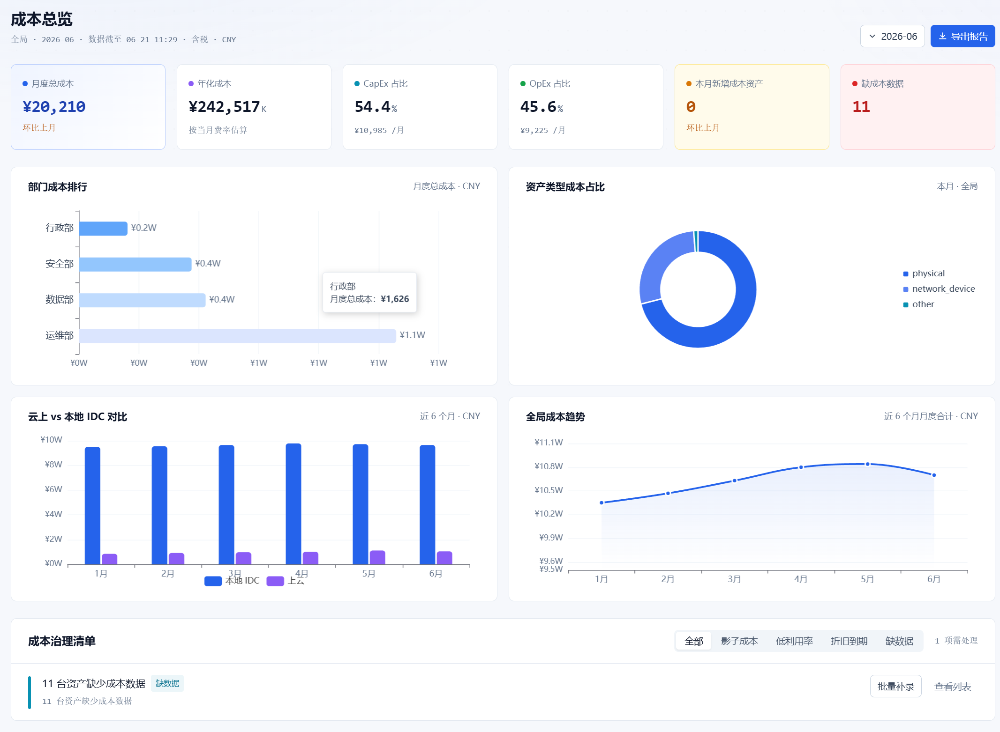  |

### 部门账单（`/cost/billing`）

- 双栏布局：可搜索部门列表 + 账单内容
- 周期摘要（日/月/年/自定义）+ 3 个 KPI
- 资源明细表 + 成本类型环形图 + 资源排行条形图
- CSV 导出完整账单明细

| 摘要  |
|------|
| 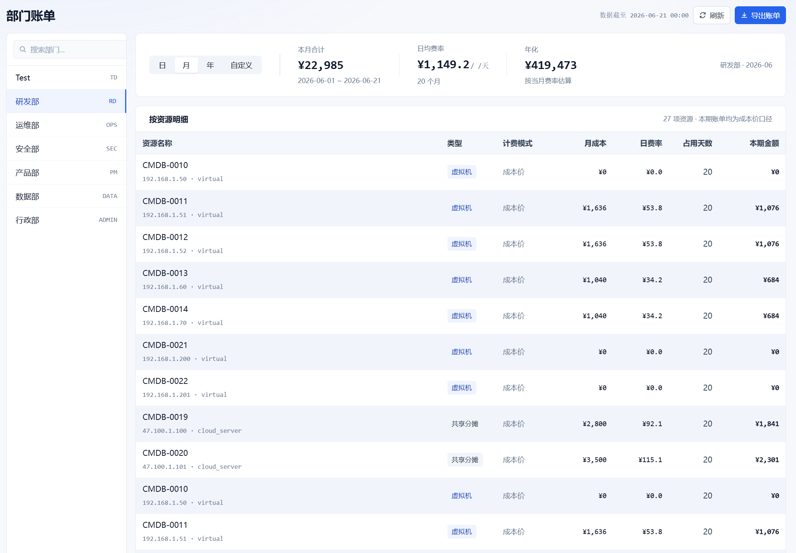  |

### 资产成本面板（资产详情 → 成本构成 Tab）

- 3 个 KPI 卡片：全负载月成本、资产净值、剩余折旧月数
- 成本构成环形图 + 各项成本明细（含进度条与百分比）
- 折旧信息区（购置价、日期、方法、月折旧、期满策略、进度条）
- 期满提醒横幅，支持选择期满策略

### 成本费率设置（`/cost/rates`）

- 折旧参数表（6 类资产 × 年限/残值率/方法/策略）
- 电力、带宽、机房参数
- 资源单价表（vCPU/内存/存储/带宽/IP），支持启用/禁用
- 分摊默认动因（按类型配置）
- 币种选择（CNY/USD），所有页面显示自动切换

### 系统配置 — 功能开关

- Hero 风格总开关卡片，启用/禁用整个成本模块
- 仅 super_admin 可操作，关闭时弹确认对话框
- 开启后显示快捷入口链接

### 其他改进

- **资产列表排序**：全部 10 列支持点击正序/倒序排列
- **时区感知显示**：中文→北京时间(UTC+8)，英文→美东时间
- **币种感知显示**：¥/CNY 与 $/USD 根据费率设置自动切换
- **GoatCounter 访问统计**：隐私友好的页面访问追踪
- **版本号升级至 V0.4.0**

---

## V0.3 版本简介

V0.3 为 Z-CMDB Lite 带来了**完整的国际化（i18n）支持**，在整个前端新增中/英双语切换能力。默认语言改为英文，任意页面均可通过顶栏切换按钮或系统配置页一键切换语言。README 文档也同步拆分为独立的中英文版本。

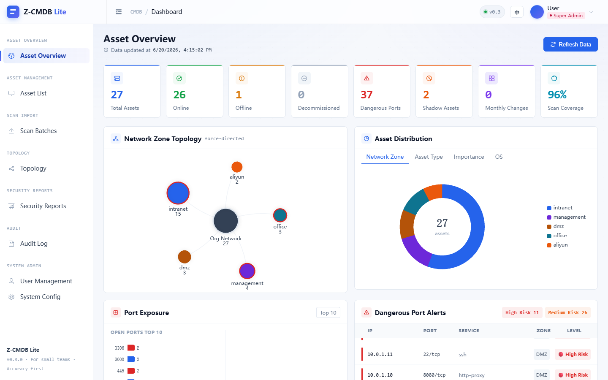

### 双语界面

- **完整英文翻译**覆盖全部 16 个页面和 3 个共享组件——每个按钮、标签、提示、验证消息、图表标题均已本地化
- **顶栏语言切换按钮**（EN/中），任意页面即时切换，无需进入设置页

| 英文版 | 中文版 |
|--------|--------|
| 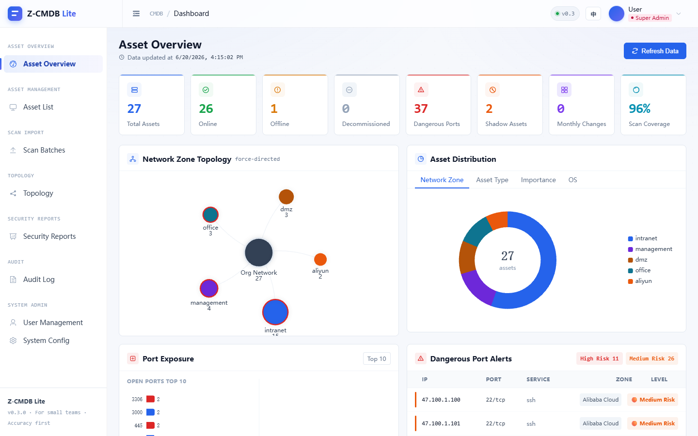 | 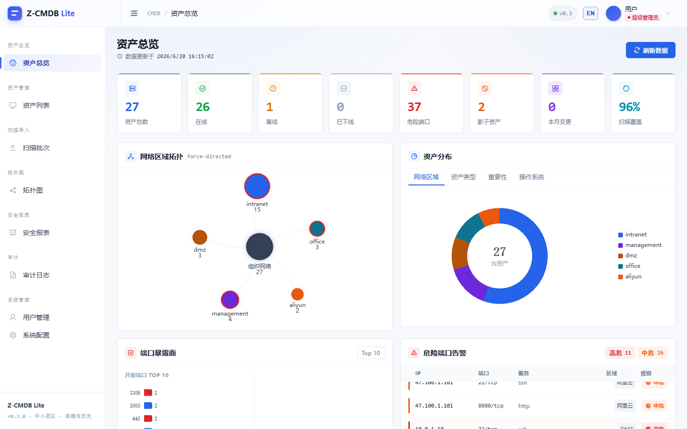 |
| 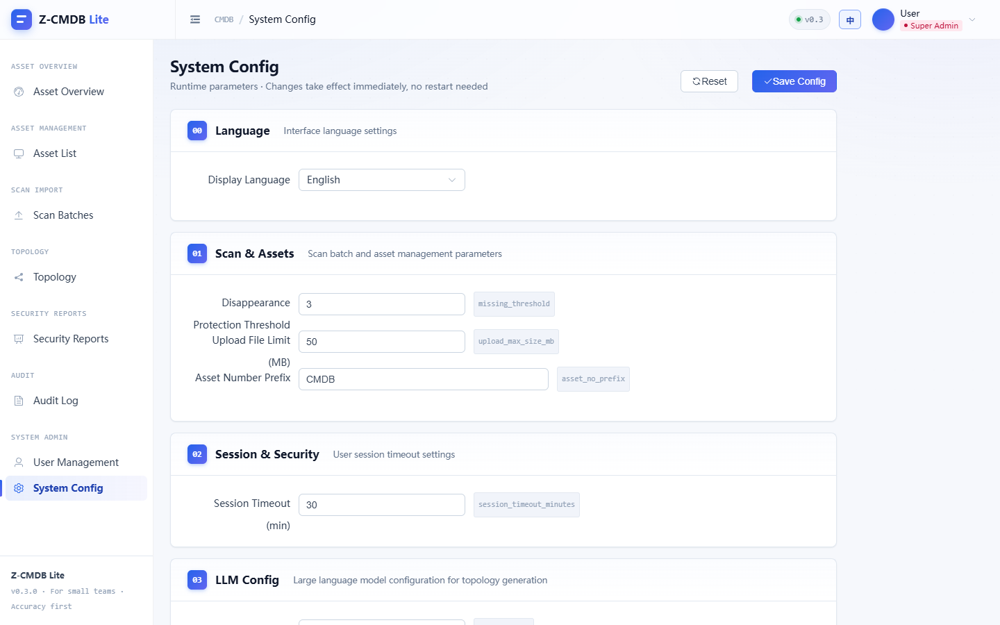 | 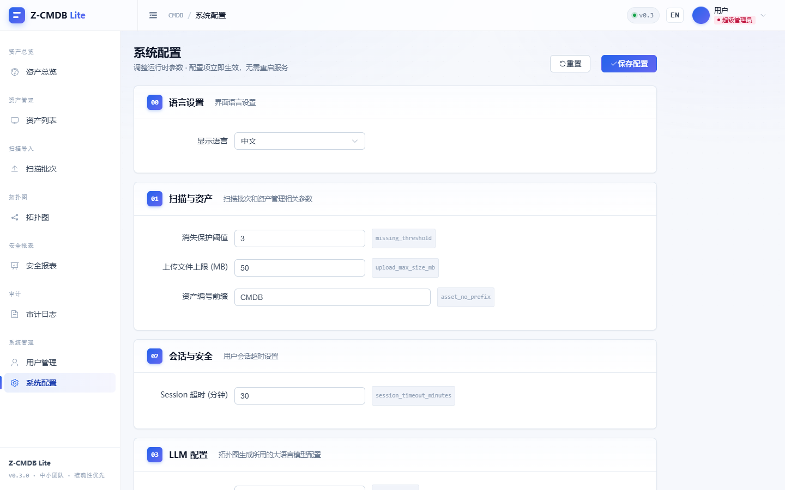 |

- **系统配置语言选择器**（section 00），下拉选择 English / 中文
- **偏好持久化**存储在 `localStorage`——语言选择在刷新和重启后保持不变
- **Element Plus 组件库语言同步**——分页文字、日期选择器、表格空状态等内置组件标签通过 `ElConfigProvider` 动态切换
- **ECharts 图表重渲染**——仪表盘图表（拓扑图、分布图、端口暴露面）在语言切换时自动以本地化标签重新渲染

### README 拆分

- `README.md`（英文，默认）和 `README_zh.md`（中文）首行互相链接，可一键切换阅读语言
- 两个版本结构和截图保持同步

---

## ✨ V0.2 版本简介

V0.2 新增**资产总览**（`/dashboard`）作为登录后的默认首页，把原本散落在报表、资产列表里的关键指标聚合到一屏，让运维与安全工程师一打开就能掌握整体资产安全态势。本版同步完成了一轮前端工程质量
优化。

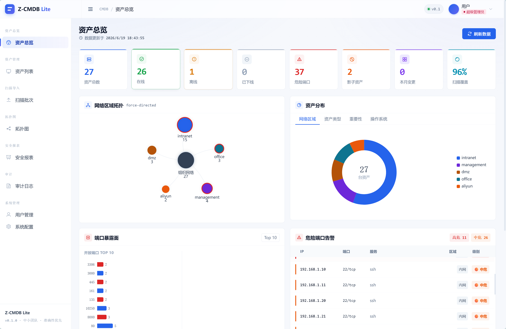

### 资产总览

整页数据由后端聚合接口 `GET /api/reports/dashboard-summary` 一次性提供（SQL 聚合 + 30s TTL 缓存，刷新整页仅一次请求）。页面由 5 个模块组成：

**① KPI 指标卡（8 项）**
资产总数 · 在线 · 离线 · 已下线 · 危险端口 · 影子资产 · 本月变更 · 扫描覆盖率。进入页面时数字以翻牌动效落位；「在线 / 离线 / 已下线」卡片可点击，直达资产列表并自动套用状态筛选。

**② 网络区域拓扑图**
基于 ECharts force-directed 力导向布局，按 `network_zone` 聚合，节点大小反映资产数量；存在核心资产的区域以红色边框高亮，支持拖拽与缩放探索。

**③ 资产分布环形图**
环心展示资产总数，顶部 Tab 一键切换四个维度：网络区域 / 资产类型 / 重要性 / 操作系统。

**④ 端口暴露面**
左侧为开放端口 Top 10 水平柱状图（危险端口自动标红），右侧为按网络区域分布的占比环形图。

**⑤ 危险端口告警滚动列表**
滚动播报危险端口明细（IP / 端口 / 服务 / 区域 / 级别），按高危、中危着色，高危行脉冲提醒；鼠标悬停自动暂停，便于查看。


### 工程优化

- **移除废弃大屏代码**：清理早期未启用的固定分辨率大屏实现（`panels/*`、`ScreenContainer`、`registry`），统一以响应式资产总览页为唯一实现，消除两套并行代码与配色不一致
- **性能**：首次加载命中后端缓存（仅「刷新数据」按钮强制刷新）、窗口 `resize` 防抖、ECharts 实例 `shallowRef` 化、去除冗余 `deep` 监听
- **响应式**：新增桌面 / 笔记本 / 平板断点，KPI 卡片 8 → 4 → 2 列自适应，窄屏下双列卡片自动单列堆叠
- **体验**：加载骨架屏替代空白页、可点击 KPI 增加 hover 反馈、危险端口列表在页面切到后台时自动暂停滚动（修复后台空转与定时器泄漏）
- **无障碍**：数字翻牌、高危脉冲、自动滚动均尊重系统「减少动态效果」（`prefers-reduced-motion`）设置
- **可维护性**：区域配色 / 危险端口 / 区域映射等常量提取为单源（`constants/dashboard.ts`），KPI 图标抽为独立组件

> 完整变更记录见文末 [更新日志](#更新日志)。

---

## 功能概览

### 🗂 资产管理

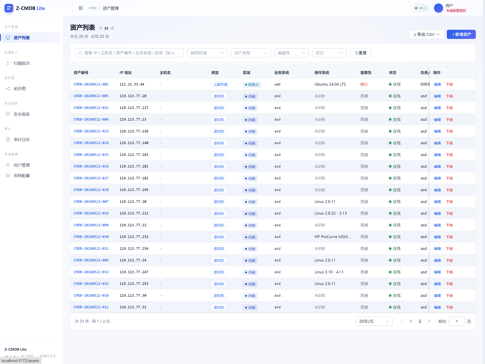

- 支持物理服务器、虚拟机、**云服务器**、网络设备、其他五种资产类型
- 云服务器选择后，网络区域自动切换为云服务商（阿里云 / 腾讯云 / 华为云 / AWS / Azure / GCP）
- 多维度筛选：网络区域、资产类型、重要性、状态
- 全文搜索：IP、主机名、资产编号、业务系统、**应用名称**（如 nginx、mysql）
- 批量操作：批量修改负责人、业务系统、重要性、网络区域
- 导出：标准 CSV + 威胁狩猎助手兼容格式

### 📋 资产详情

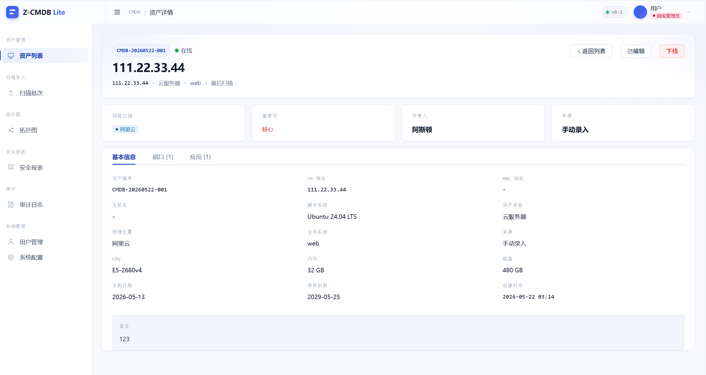

三个标签页一站式查看：

| 标签页 | 内容 |
|--------|------|
| 基本信息 | 资产编号、IP/MAC/主机名、OS、归属、硬件、采购保修 |
| 端口 | 扫描发现的开放端口，含服务名、版本、状态 |
| 应用 | 手动登记或扫描提取的应用清单，含版本、端口、安装路径 |

**端口与应用双向同步**：手动新增应用时填写端口，自动写入端口表；nmap 扫描确认导入时，有 service_name 的端口同步生成应用记录。

### 📡 扫描批次

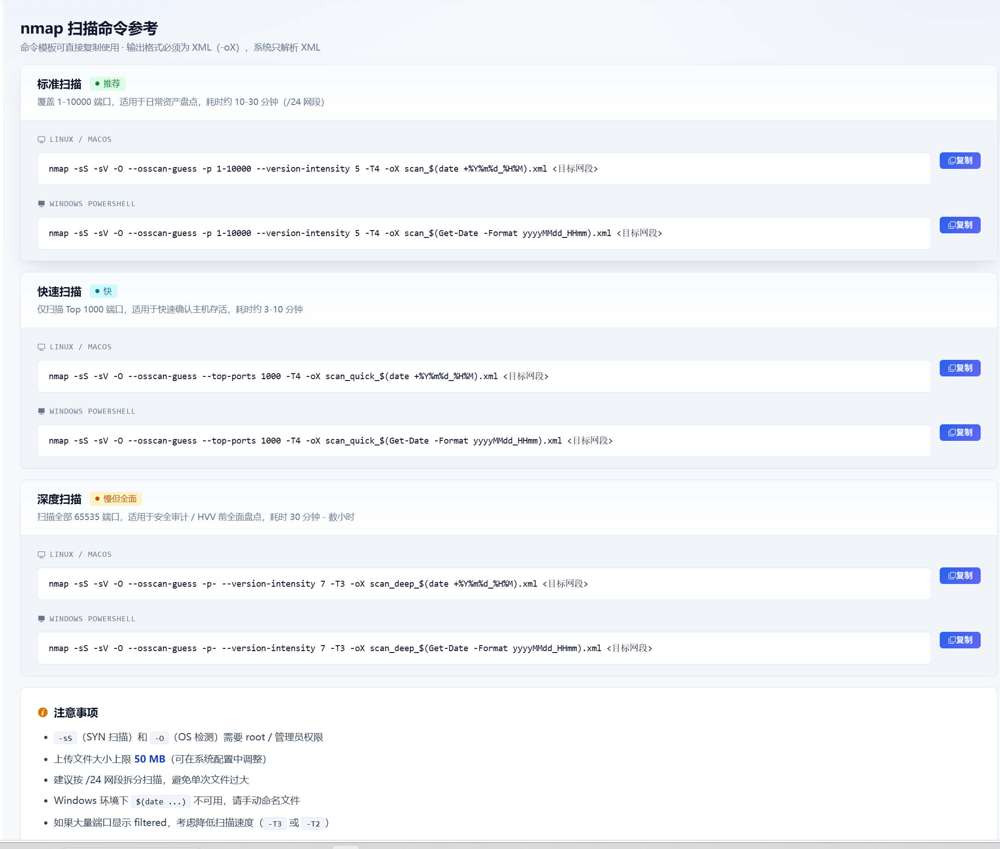
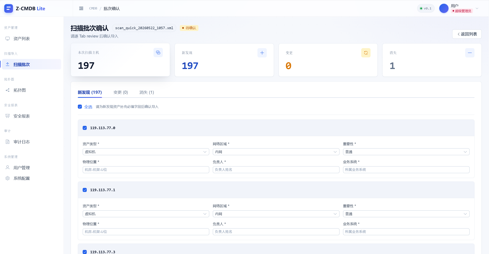

1. 在跳板机运行 nmap，生成 XML 报告
2. 上传到平台，自动解析并与现有资产做差异分析
3. 差异分为四类：**新发现** / **变更** / **消失** / **恢复**
4. 人工审核每台主机的端口变更详情后确认导入
5. 消失主机不立即删除，`missing_count + 1`，超过阈值才标记离线

### 🗺 拓扑图（AI 生成）

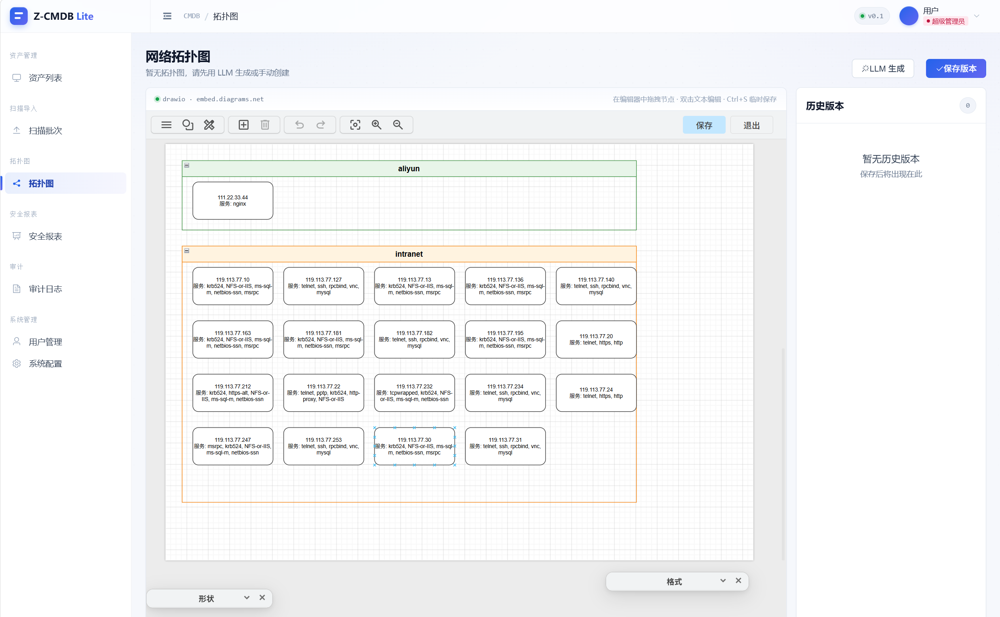

- 一键调用 LLM 生成 drawio 网络拓扑图初稿
- 支持 DeepSeek / OpenRouter / 本地 Ollama
- 资产数据**自动脱敏**后投喂 LLM（IP → 占位符，业务系统 → 代号）
- 核心资产可配置强制走本地模型，敏感数据不出内网
- 生成后可在内嵌 drawio 编辑器中手工调整，支持版本管理和回滚

### 📊 安全报表

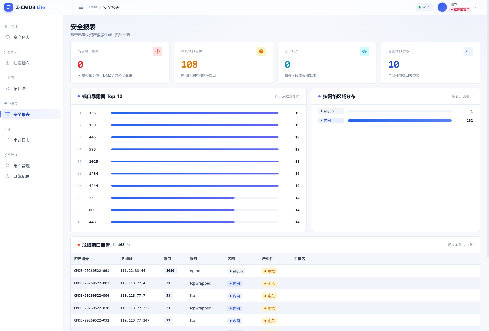

- 资产分布：网络区域、重要性、操作系统、资产类型
- 端口暴露面分析：Top 端口、高危端口统计
- 扫描覆盖率：最近扫描时间分布
- 威胁狩猎助手兼容导出：按"资产 × 应用"展开，含 environment / criticality / exposure_scope / vendor 字段

### 📝 审计日志

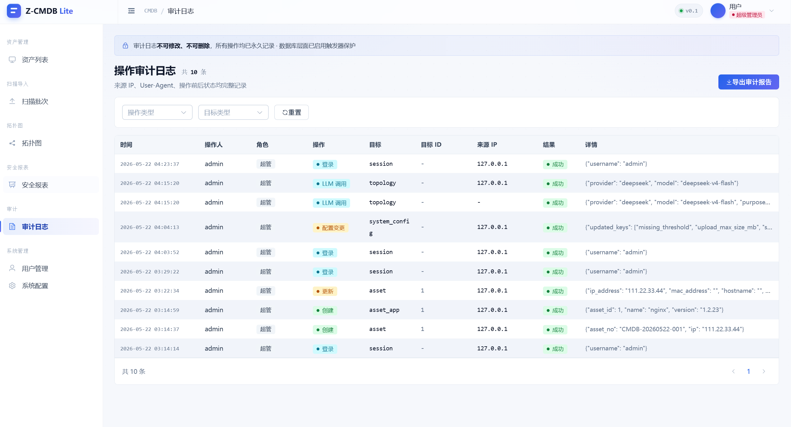

- 记录所有登录、增删改、导出、LLM 调用操作
- **不可篡改**：SQLite 触发器在数据库层禁止 UPDATE / DELETE
- 支持按动作类型、用户、目标类型筛选

### 👥 用户与权限

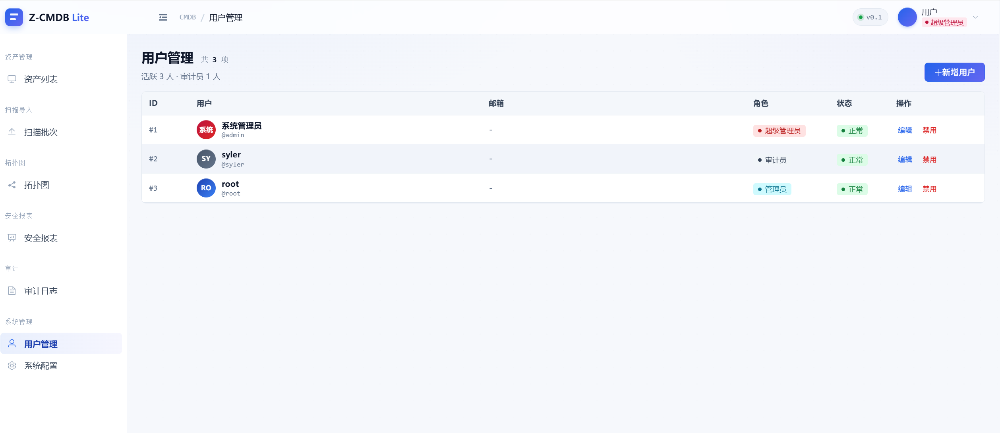

三种角色，职责分离：

| 角色 | 权限 |
|------|------|
| `super_admin` | 全部操作 + 用户管理 + 系统配置 |
| `admin` | 资产增删改、扫描上传确认、拓扑生成 |
| `auditor` | 只读 + 审计日志查看 |

> 系统要求至少创建一个 auditor 账号才能解锁完整功能（等保职责分离要求）。

### ⚙️ 系统配置

- LLM 提供方 / API Key / 模型 / Base URL
- 核心资产路由策略（是否强制走本地 Ollama）
- 资产编号前缀（默认 `CMDB`）
- 扫描消失阈值（连续 N 次未扫到才标记离线）
- 上传文件大小限制

---

## 技术栈

| 层 | 选型 |
|---|------|
| 后端语言 | Python 3.11+ |
| Web 框架 | FastAPI |
| 数据库 | SQLite 3（WAL 模式，单文件） |
| ORM | SQLAlchemy 2.0 |
| 数据迁移 | Alembic |
| 前端框架 | Vue 3 + Vite + TypeScript |
| UI 组件库 | Element Plus |
| 状态管理 | Pinia |
| 密码哈希 | argon2id |
| 认证 | JWT（access + refresh token） |
| 部署 | Docker + docker-compose |

---

## 快速开始

### 方式一：Docker（推荐）

```bash
# 1. 克隆项目
git clone https://github.com/Zer00n/z-cmdb.git
cd z-cmdb

# 2. 配置 JWT 密钥
cp secrets/jwt_secret.txt.example secrets/jwt_secret.txt
# 编辑 secrets/jwt_secret.txt，填入随机字符串（建议 32 位以上）

# 3. 启动
docker compose -f docker/docker-compose.yml up --build -d

# 4. 访问
# http://localhost:8080

# 5. 获取初始密码（首次启动自动生成）
# 方式一：查看容器日志
docker compose -f docker/docker-compose.yml logs backend | grep "密码"
# 方式二：读取密码文件
cat data/INITIAL_ADMIN_PASSWORD.txt
# 默认账号：admin，用上面获取的密码登录

# （可选）预设初始密码，Docker 与 Windows 两模式一致：
# 在仓库根目录创建 .env 文件，写入：
# CMDB_INITIAL_ADMIN_PASSWORD=YourPassword@123
# 然后用以下命令启动：
# docker compose --env-file .env -f docker/docker-compose.yml up --build -d
```

### 方式二：本地开发（Windows 11）

**一键启动**

项目根目录提供了 Windows 批处理脚本，双击即可同时启动前后端：

```
dev-start.bat    # 一键启动后端 + 前端（自动打开两个终端窗口）
dev-stop.bat     # 一键停止所有服务
```

> 前提：已完成下方的环境初始化（venv + pnpm install + alembic upgrade head）。

**环境初始化（仅首次）**

```powershell
# 后端
cd backend
uv venv
.venv\Scripts\activate
uv pip install -r requirements.txt
alembic upgrade head

# 前端
cd ..\frontend
pnpm install
```

**手动启动（如需分别调试）**

后端：

```powershell
cd backend
.venv\Scripts\activate
uvicorn app.main:app --reload --host 127.0.0.1 --port 8000
```

前端（新终端）：

```powershell
cd frontend
pnpm dev
```

访问 http://localhost:5173  
初始密码见 `backend/data/INITIAL_ADMIN_PASSWORD.txt`（首次启动自动生成）。

---

## 项目结构

```
z-cmdb/
├── backend/
│   ├── app/
│   │   ├── cli.py            # 管理 CLI（init-db / reset-admin）
│   │   ├── core/           # 配置、安全、依赖注入、加密
│   │   ├── models/         # SQLAlchemy 模型
│   │   ├── schemas/        # Pydantic v2 Schema
│   │   ├── routers/        # API 路由
│   │   ├── services/       # 业务逻辑
│   │   ├── repositories/   # 数据访问层
│   │   └── utils/          # nmap 解析等工具
│   ├── alembic/            # 数据库迁移脚本
│   └── requirements.txt
├── frontend/
│   └── src/
│       ├── views/          # 页面组件
│       ├── components/     # 通用组件
│       ├── api/            # API 封装
│       ├── stores/         # Pinia 状态
│       ├── styles/         # 全局样式 & Design Token
│       ├── types/          # TypeScript 类型定义
│       └── constants/      # 枚举常量（OS 选项、应用分类等）
├── docker/                 # Dockerfile & docker-compose
├── scripts/                # 运维脚本（重置密码、导出审计等）
├── secrets/                # JWT 密钥（不提交，仅 .example 文件）
├── img/                    # 功能截图
└── README.md
```

---

## nmap 扫描参考

```bash
# 快速扫描（常用端口）
nmap -sV -T4 -oX scan_result.xml 192.168.1.0/24

# 全端口扫描
nmap -sV -p- -T4 -oX scan_full.xml 192.168.1.0/24

# 指定端口 + OS 识别
nmap -sV -O -p 22,80,443,3306,6379,8080 -oX scan_web.xml 192.168.1.0/24
```

扫描完成后，将 `.xml` 文件上传到平台「扫描批次」页面即可。

---

## 安全说明

- 密码使用 argon2id 哈希（memory=64MB, time=3, parallelism=4）
- JWT 支持 access token（短期）+ refresh token（长期）
- 登录失败超过阈值自动锁定账户
- 所有响应头包含 CSP / X-Content-Type-Options / X-Frame-Options
- 审计日志通过数据库触发器保证不可篡改
- LLM 调用前对资产数据脱敏，核心资产可强制走本地模型

---

## 忘记密码 / 重置管理员

**Docker 环境：**

```bash
# 重置为随机密码（新密码打印到终端并写入 data/INITIAL_ADMIN_PASSWORD.txt）
docker compose -f docker/docker-compose.yml exec backend python -m app.cli reset-admin

# 重置为指定密码
docker compose -f docker/docker-compose.yml exec backend python -m app.cli reset-admin --password 'YourNew@Pass1'
```

**本地开发：**

```powershell
cd backend
.venv\Scripts\activate
python -m app.cli reset-admin
# 或指定密码：
python -m app.cli reset-admin --password 'YourNew@Pass1'
```

---

## ⚠️ 注意事项

**本项目不建议部署到正式生产环境。**

Z-CMDB Lite 的设计定位是个人或小团队的本机工具，适合以下使用方式：

- 部署在**本机或内网工作站**上，随用随启动
- 用完后关闭服务（`dev-stop.bat` 或直接关终端），不长期暴露在网络上
- **不要将服务端口暴露到公网**，如确需远程访问请配合 VPN 或 SSH 隧道
- 数据库为 SQLite 单文件（`backend/data/cmdb.db`），定期备份即可
- 默认管理员密码请在首次登录后立即修改（系统会强制要求）

如果你的场景涉及多人并发写入（>50 人）、高可用、或需要对外提供服务，请考虑使用 PostgreSQL 等生产级数据库方案。

---

## 更新日志

### V0.6（2026-06-25）

> **升级须知**：拉取 V0.6 后执行 `cd backend && alembic upgrade head`，共 6 个迁移：创建项目表、新增主机 ip_address 列、移除已删除的 AI 摘要缓存列、项目部门字段、Excel 数据源支持。

**项目管理**
- 新增 `/projects` 路由，含项目列表、项目架构页（Vue Flow 拓扑图）、项目账单标签页
- 6 张新数据库表：`project`、`consuming_unit`、`placement`、`unit_relation`、`billing_policy`、`bill_snapshot`
- `host_resource` 新增 `ip_address` 字段
- **项目删除**：操作列新增删除按钮，需输入项目名称确认后方可删除
- **部门字段**：`project` 表新增 `department` 列；项目列表支持按部门筛选；项目创建/编辑时通过下拉选择关联部门

**部门管理（`/departments`）**
- 新增部门管理页面，支持新增、编辑、删除（仅 super_admin）
- 复用 V0.4 费用核算模块已有的 `departments` 表
- 侧边栏「系统管理」分组下新增入口

**项目成本核算（`/projects/billing/departments`）**
- 新增按部门汇总项目账单成本的页面
- KPI 卡片（总成本、部门数、总项目数）+ 饼图 + 汇总表格
- API 端点：`GET /api/projects/billing/department-summary?period=YYYY-MM`

**Excel 资产导入**
- 模板下载：`GET /api/scans/template/excel` — 标准 .xlsx 模板，19 列，表头含字段说明
- 上传端点：`POST /api/scans/upload-excel` — 解析 Excel 为 ParsedHost，复用整个扫描批次流水线
- 行列级校验，错误精确定位到行号和列名
- 确认页复用扫描批次确认页；补充字段（CPU、内存、磁盘等）从 Excel 数据预填
- IP 去重：已有资产标记为重复，新资产以 `source="excel"` 创建
- `scan_batches` 表新增 `source` 列（`scan` / `excel`）
- `assets.source` CHECK 约束扩展为包含 `'excel'`
- 新增依赖：`openpyxl>=3.1.0`

**拓扑图（Vue Flow）**
- HTML/CSS 平铺替换为 Vue Flow 交互式画布
- 确定性模板布局：主机按依赖拓扑排序、组件组内纵向堆叠
- 自定义节点：`HostGroupNode`（共享主机橙色高亮）、`UnitNode`（类型色条）
- 依赖边：smoothstep 箭头 + rel_type 标签，环检测（虚线橙色）
- 组件清单「管理依赖」对话框（新增/删除 unit_relation）

**账单**
- 读后冻结模式：首次读取时由分摊引擎生成账单，之后冻结不变
- 丰富账单返回：消费单元/主机名称、主机月成本、内存占比（绝对值+百分比）、主机详情、上月环比
- 七列成本拆解表 + 共享主机分摊说明模块（含守恒校验）
- 根因修复：为所有 host_resource 填充真实的 monthly_cost / cpu_total / mem_total

**资产总览**
- KPI 行新增 5 张项目维度卡（项目总数、消费单元、归属覆盖率、本月项目总成本、全局未分摊桶）
- 新增 `_build_project_summary()` 聚合函数（从 bill_snapshot 取数，复用现有缓存）
- 资产分布饼图新增「按项目」第 5 维度 tab
- 统一 KPI 网格布局 + 分隔线，饼图 legend 可滚动 + 文字截断

**移除**
- AI 项目摘要：删除 `engine/summary.py`、`/api/projects/{id}/summary` 接口、`Project` 模型摘要缓存列、相关 i18n key 和 PRD 章节

**迁移**
- `a2b3c4d5e6f7` — v0.6 项目表
- `b7c8d9e0f1a2` — 摘要缓存列（同版本内移除）
- `c8d9e0f1a2b3` — 主机 ip_address
- `d1e2f3a4b5c6` — 移除摘要列
- `e2f3a4b5c6d7` — 项目部门字段
- `f1a2b3c4d5e6` — Excel 数据源支持（scan_batches.source + assets CHECK）

### V0.5（2026-06-23）

> **升级提示**：拉取 V0.5 代码后，请在 `backend/` 目录执行 `alembic upgrade head` 以创建新的 `import_preset` 表。缺少此步骤应用将无法启动。

**录入预设系统**
- 新增 `/import-presets` 设置页面，位于左侧导航「扫描导入」下，双栏布局（类目列表 + 预设值表格）
- 三类预设类目：`location`（物理位置）、`owner`（负责人）、`business_system`（业务系统），支持完整 CRUD + 搜索 + 排序 + 备注
- 每类目至多一个默认值，由 partial unique index（`ix_preset_one_default`）在数据库层强制保证
- 「从现有资产抽取」按钮：对资产表三列 `SELECT DISTINCT`，过滤空值后去重灌入预设库
- 新增数据库表 `import_preset`，Alembic 迁移 `c7d8e9f0a1b2`
- 新增 7 个 API 端点（`/api/import-presets`：列表、类目元数据、新增、修改、设默认、删除、从资产抽取）
- 所有写操作通过 `audit_service.log_from_request` 记录审计日志

**PresetSelect 组件**
- 可复用 `el-select` 组件，支持 `filterable` + `clearable` + footer 插槽行内新增
- 应用于确认导入、手动新增资产、批量编辑三个场景
- 由 Pinia store（`useImportPresetStore`）集中管理，按类目懒加载 + 缓存

**确认导入页改造**
- 物理位置 / 负责人 / 业务系统字段从 `el-input` 替换为 `PresetSelect`
- 页面加载时自动从预设库填入默认值
- 新增批量预设工具栏：字段 + 预设值 + 范围（选中行/全部行）+ 套用，纯前端操作
- 分步加载提示：「加载预设值...」→「计算差异...」+ 脉冲圆点动画
- 确认提交时全屏遮罩 + 旋转图标，防止重复点击

**资产表单 & 资产列表**
- 资产新增/编辑表单：物理位置、负责人、业务系统替换为 `PresetSelect`，新增时自动预填默认值
- 资产列表新增 checkbox 多选列 + 批量编辑弹窗（PresetSelect）
- `PATCH /api/assets/bulk` 新增 `location` 字段支持

**上传进度条**
- 上传改用 `XMLHttpRequest.upload.onprogress` 获取真实百分比（0→100%）
- 文件传输完成后切换为不确定脉冲动画（"正在解析扫描数据..."）
- 扫描相关 API 的 axios timeout 从 30s 提升至 120s

**其他**
- 全局滚动条宽度调整为 10px 实心（原为 4px 可见 + 透明边框）
- 全部新增 UI 文案中英双语完整（vue-i18n）

### V0.4（2026-06-21）

**资产费用核算（可选功能）**
- 新增 `feature_cost_accounting_enabled` 功能开关（默认关闭，仅 super_admin 可操作）
- 成本总览仪表盘（`/cost/overview`）：6 个 KPI、4 张 ECharts 图表、成本治理清单
- 部门账单（`/cost/billing`）：可搜索部门列表、周期切换、资源明细表、成本类型环形图 + 资源排行条形图、CSV 导出
- 资产详情 → 成本构成 Tab：3 个 KPI、成本构成环形图、折旧进度条、期满提醒
- 成本费率设置（`/cost/rates`）：折旧参数/电力/带宽/机房参数、资源单价表、分摊动因、币种选择（CNY/USD）
- 资产表单新增 Section 04 成本字段（购置价、折旧月数、残值率、方法、策略、计费模式、责任部门）
- 5 张新表：departments、asset_cost_items、asset_relations、asset_dept_assignments、cost_rates
- 资产主表扩展 10 个成本字段
- 纯计算引擎：直线法折旧、续值策略、共享成本分摊（按动因/均摊）、守恒校验
- 所有成本 API 统一挂 `require_cost_feature` 依赖，功能关闭时返回 403

**资产列表排序**
- 全部 10 列（资产编号、IP、主机名、类型、区域、业务系统、操作系统、重要性、状态、负责人）支持点击正序/倒序

**时区与币种**
- 所有时间戳根据界面语言切换时区：zh → Asia/Shanghai (UTC+8)，en → America/New_York
- 成本金额根据费率设置切换符号：CNY → ¥，USD → $
- 新增 `useTimeFormat` 和 `useCostCurrency` composable 集中管理显示逻辑

**国际化补充**
- 新增 `cost.ts` 语言模块（en + zh），200+ 翻译键覆盖所有成本页面、表单、图表、CSV 导出
- 修复 `[intlify] Not found` 警告：数组值改用 `tm()`，所有 label 函数增加空值守卫
- 修复 `el-pagination` `small` 属性废弃 → `size="small"`

**访问统计**
- 集成 GoatCounter 页面访问追踪（隐私友好、异步加载）
- `allow_local: true` 支持本地开发环境统计
- Login.vue 兜底注入脚本（防止 index.html 脚本被移除）

### V0.3（2026-06-20）

**国际化（i18n）**
- 新增完整中/英双语支持，基于 vue-i18n@9（Composition API 模式）
- 默认语言改为英文；所有 UI 字符串已翻译
- 顶栏新增语言切换按钮（EN/中），任意页面可快速切换
- 系统配置页新增语言设置卡片（section 00），支持下拉选择
- 语言偏好持久化到 localStorage，刷新后保持
- Element Plus 组件库语言（分页、日期选择器、表格空状态）通过 ElConfigProvider 动态切换
- README 拆分为英文版（`README.md`，默认）和中文版（`README_zh.md`），首行互相链接切换
- 翻译文件按模块拆分：common、layout、router、login、dashboard、asset、scan、topology、report、audit、user、settings、help、components、constants
- 共享 `useTranslatedLabels()` composable 集中管理 zoneLabel/importanceLabel/statusLabel/typeLabel/roleLabel 函数

### V0.2（2026-06-19）

**资产总览**
- 新增 `/dashboard` 资产总览页面，作为登录后默认首页
- 8 类 KPI 指标卡片（资产总数、在线/离线/已下线、危险端口、影子资产、本月变更、扫描覆盖率），带数字翻牌动效
- 网络区域拓扑图（ECharts force-directed），按 `network_zone` 聚合，核心资产红色边框
- 资产分布环形图，支持网络区域/资产类型/重要性/操作系统四维度切换
- 端口暴露面：开放端口 Top 10 水平柱状图 + 按区域分布环形图
- 危险端口告警滚动列表，按严重性着色（高危脉冲动画），悬停暂停
- 影子资产（缺字段 + 长期离线）Tab 切换展示
- 资产变化时间线、审计与 LLM 活动流滚动播报
- 后端聚合接口 `GET /api/reports/dashboard-summary`，SQL 聚合 + 30s TTL 缓存，单次刷新仅一次请求
- 危险端口清单与高危区域从硬编码迁入 `system_configs` 配置，报表与总览共用同一判定逻辑
- 布局持久化（个人布局 + 全局默认），`system_configs` KV 存储

**Docker 部署修复**
- 后端依赖改用 `/opt/venv` 虚拟环境，解决 `docker exec` 下 `import sqlalchemy` 失败
- 新增应用内 CLI `python -m app.cli`（`init-db` / `reset-admin`），无需拷贝 scripts 进容器
- 初始密码可控：支持 `CMDB_INITIAL_ADMIN_PASSWORD` 环境变量预设，未设置则随机生成并写入 `data/INITIAL_ADMIN_PASSWORD.txt`
- 新增 `COOKIE_SECURE` 配置项，修复 HTTP 部署下 refresh token cookie 被浏览器拒绝的问题
- 新增 `.env.example` 环境变量模板
- 本地开发脚本（`scripts/reset_admin.py`、`init_db.py`）修正路径逻辑，复用 CLI 服务层

**拓扑图优化**
- 修复路由到 Ollama 时复用 OpenRouter 模型名导致 502 的 Bug
- 新增 Ollama 可用性检测，不可用时给出明确中文提示（而非晦涩的 502）
- 新增 `llm_ollama_model` 独立配置，Ollama 路由使用专用模型名
- LLM 提供方简化为「自定义」和「本地」两个选项，自定义支持任意 OpenAI 兼容 API
- 拓扑图页面新增「生成日志」Tab，显示 LLM 调用过程和详情（提供方/模型/耗时）
- 修复配置页面保存时掩码值覆盖真实 API Key 的 Bug

**其他改进**
- 修复修改密码 422 错误：前端密码策略校验（>= 12 位 + 大小写数字符号）与后端对齐
- 422 Pydantic 校验错误信息正确展示（从 `detail` 数组提取 `msg`）
- 后端 `llm_service.get_provider()` 不再校验 provider 名称，非 ollama 一律走 OpenAI 兼容接口

---

## License

[MIT](LICENSE)
